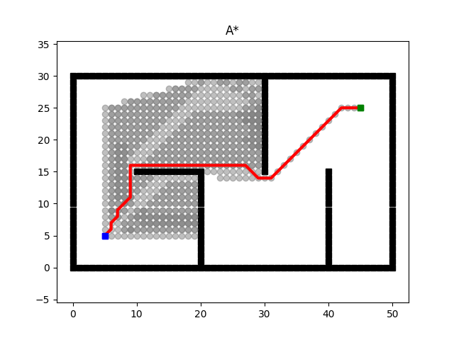

# 类A\*算法在不同heuristic函数选取下的表现

## 代码实现与常规A\*的区别

原repo中的代码实现在A*的基础上，允许将closed中的节点重新加入open，允许open中存在多个cost不同的同一节点的键值对。前者可能为特性，后者猜测为bug。

由于以上两点的存在，算法运行过程中存在一个node被展开多次的情况。下列图片中，颜色较深的node意味着该node被多次展开了（展开此数越多，颜色越深）。

这会导致搜索迭代次数的增加，对于一些干扰性的heuristics函数，能够成倍增加。而优点为，各node的parent会被反复刷新至以探索的路网中cost最小的。

## 正常选取：

1. 对角距离

   ```python
   mn = min(abs(goal[0] - s[0]), abs(goal[1] - s[1]))
   mx = max(abs(goal[0] - s[0]), abs(goal[1] - s[1]))
   h = math.sqrt(2) * mn + (mx - mn)
   ```

   共迭代了592次

   

2. manhattan距离（原程序自带）

   ```python
   h = abs(goal[0] - s[0]) + abs(goal[1] - s[1])
   ```

   共迭代了912次

   

3. 欧氏距离（原程序自带）

   ```python
   h = math.hypot(goal[0] - s[0], goal[1] - s[1])
   ```

   共迭代了748次

   

## 恶意选取的函数：

4. 远离中心

   ```python
   h = math.hypot(s[0] -25, s[1] - 15)*-8
   ```

   共迭代了2605次

   

5. 靠近右上（y权重大于x）

   ```python
   h = -10 * s[1] -2 * s[0]
   ```

   共迭代了4319次

   

6. 靠近上方（大权重）

   ```python
   h = -50 * s[1]
   ```

   共迭代了5222次

   

## 参照组：

7. Dijkstra

   ```python
   h = 0
   ```

   共迭代了1294次

   
